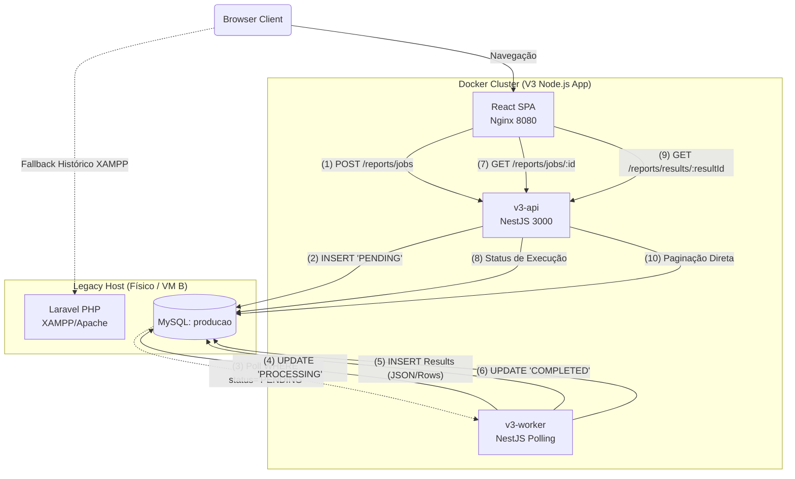

# V3 Architecture & Topology

Este documento descreve as bases do ecossistema arquitetônico da terceira revisão da Consulta, substituindo a stack nativa Full-Stack Laravel + jQuery legado por um modelo Desacoplado baseado em React e NestJS.

## Visão Geral

- **UI/Frontend**: React (Vite) hospedado em container Nginx estático (Desktop-first DataHeavy layout).
- **Backend API**: NestJS (Node.js 22 LTS Alpine) rodando em porta sincronizada HTTP.
- **Backend Worker**: NestJS reaproveitado, configurado via env variable `RUN_WORKER=true`, focado em Job Polling.
- **Banco de Dados Primário**: MySQL (XAMPP Legado ou MySQL Server Físico host B - `producao` e `portald2`), estritamente de fora da rede purista do Docker. Nenhum dado transacional histórico é importado para os containers.

## Diagrama de Componentes e Fluxo de Jobs (Node vs Laravel/XAMPP)
O fluxo moderno desvia estresse imediato do Request Loop para processamento Background contínuo, orquestrado 100% sobre o banco de dados.

### Explicação do Fluxo de Jobs
Conforme desenhado em ADR-0003, toda orquestração de long-run process no projeto Consulta V3 não exige Redis e depende essencialmente do MySQL (`aux_jobs.sql`).

1. **Gatilho Inicial**: A UI (`React Web`) coleta os parâmetros (competência, filtros pesados do prestador) e posta contra a `v3-api`.
2. O Endpoint (`ReportsController`) converte para JSON e salva as flags num payload atrelado na tabela `report_job` com status `PENDING`.
3. Assincronicamente, o `v3-worker` faz polling passivo da tabela `report_job`. Encontrando uma tupla `PENDING`, ele trava seu estado atômico para `PROCESSING` (evitando condição de corrida se houver 2 workers rodando).
4. O `v3-worker` aplica a "Heavy Query" no MySQL. 
5. As métricas agregadas sobem à memória contida do motor V8/Node, e o motor descarrega as consolidações na tabela de relacionamento `report_result_header` e as linhas em `report_result_rows`.
6. Termina preenchendo o status original do Job para `COMPLETED`.
7. Paralelamente desde o PASSO 1, a UI (React SPA) entrava num mini loop de requests pingando ativamente `GET /reports/jobs/:id` de 5 em 5 segundos, com tela de Skeleton Loader.
8. Ao bater no banco via a leitura do status final = `COMPLETED`, o `v3-api` retorna Payload concluído.
9. A interface reage a Promise, resgata o array recém-calculado em `/reports/results/:id` injetando nas Props de seu DataGrid Server-side em pedaços (páginas de 50/100).
